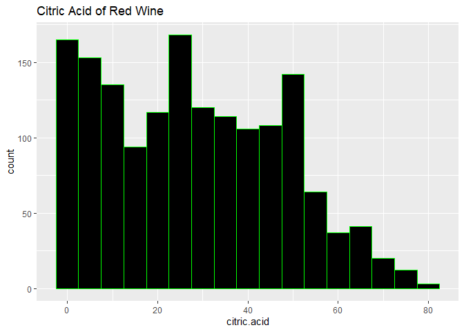

#Goal: To examine the factors that affect quality of the red wine dataset.


```r
getwd()
```

```
## [1] "C:/Users/Toby/Documents/Red-Wine-Quality-Analysis"
```

```r
setwd('C:/Users/Toby/Downloads')
wine <- read.csv2("redwine.csv", header = TRUE, sep = ",")

str(wine)
```

```
## 'data.frame':	1599 obs. of  13 variables:
##  $ X                   : int  1 2 3 4 5 6 7 8 9 10 ...
##  $ fixed.acidity       : Factor w/ 96 levels "10","10.1","10.2",..: 71 75 75 13 71 71 76 70 75 72 ...
##  $ volatile.acidity    : Factor w/ 143 levels "0.12","0.16",..: 77 113 89 13 77 69 57 67 53 42 ...
##  $ citric.acid         : Factor w/ 80 levels "0","0.01","0.02",..: 1 1 5 57 1 1 7 1 3 37 ...
##  $ residual.sugar      : Factor w/ 91 levels "0.9","1.2","1.3",..: 11 31 26 11 11 10 6 2 20 73 ...
##  $ chlorides           : Factor w/ 153 levels "0.012","0.034",..: 40 62 56 39 40 39 33 29 37 35 ...
##  $ free.sulfur.dioxide : Factor w/ 60 levels "1","10","11",..: 3 18 7 9 3 5 7 7 60 9 ...
##  $ total.sulfur.dioxide: Factor w/ 144 levels "10","100","101",..: 75 109 95 102 75 81 100 60 57 4 ...
##  $ density             : Factor w/ 436 levels "0.99007","0.9902",..: 343 272 288 355 343 343 240 101 272 343 ...
##  $ pH                  : Factor w/ 89 levels "2.74","2.86",..: 64 33 39 29 64 64 43 52 49 48 ...
##  $ sulphates           : Factor w/ 96 levels "0.33","0.37",..: 19 31 28 21 19 19 9 10 20 43 ...
##  $ alcohol             : Factor w/ 65 levels "10","10.0333333333333",..: 57 63 63 63 57 57 57 1 58 7 ...
##  $ quality             : int  5 5 5 6 5 5 5 7 7 5 ...
```

```r
wine$fixed.acidity <- as.numeric(wine$fixed.acidity)
wine$volatile.acidity <- as.numeric(wine$volatile.acidity)
wine$citric.acid <- as.numeric(wine$citric.acid)
wine$residual.sugar <- as.numeric(wine$residual.sugar)
wine$chlorides <- as.numeric(wine$chlorides)
wine$free.sulfur.dioxide <- as.numeric(wine$free.sulfur.dioxide)
wine$total.sulfur.dioxide <- as.numeric(wine$total.sulfur.dioxide)
wine$density <- as.numeric(wine$density)
wine$pH <- as.numeric(wine$pH)
wine$sulphates <- as.numeric(wine$sulphates)
wine$alcohol <- as.numeric(wine$alcohol)
```


```r
str(wine)
```

```
## 'data.frame':	1599 obs. of  13 variables:
##  $ X                   : int  1 2 3 4 5 6 7 8 9 10 ...
##  $ fixed.acidity       : num  71 75 75 13 71 71 76 70 75 72 ...
##  $ volatile.acidity    : num  77 113 89 13 77 69 57 67 53 42 ...
##  $ citric.acid         : num  1 1 5 57 1 1 7 1 3 37 ...
##  $ residual.sugar      : num  11 31 26 11 11 10 6 2 20 73 ...
##  $ chlorides           : num  40 62 56 39 40 39 33 29 37 35 ...
##  $ free.sulfur.dioxide : num  3 18 7 9 3 5 7 7 60 9 ...
##  $ total.sulfur.dioxide: num  75 109 95 102 75 81 100 60 57 4 ...
##  $ density             : num  343 272 288 355 343 343 240 101 272 343 ...
##  $ pH                  : num  64 33 39 29 64 64 43 52 49 48 ...
##  $ sulphates           : num  19 31 28 21 19 19 9 10 20 43 ...
##  $ alcohol             : num  57 63 63 63 57 57 57 1 58 7 ...
##  $ quality             : int  5 5 5 6 5 5 5 7 7 5 ...
```


```r
summary(wine)
```

```
##        X          fixed.acidity   volatile.acidity  citric.acid   
##  Min.   :   1.0   Min.   : 1.00   Min.   :  1.00   Min.   : 1.00  
##  1st Qu.: 400.5   1st Qu.:61.00   1st Qu.: 28.00   1st Qu.:10.00  
##  Median : 800.0   Median :70.00   Median : 44.00   Median :27.00  
##  Mean   : 800.0   Mean   :63.55   Mean   : 49.06   Mean   :28.08  
##  3rd Qu.:1199.5   3rd Qu.:79.00   3rd Qu.: 65.00   3rd Qu.:43.00  
##  Max.   :1599.0   Max.   :96.00   Max.   :143.00   Max.   :80.00  
##  residual.sugar    chlorides      free.sulfur.dioxide total.sulfur.dioxide
##  Min.   : 1.00   Min.   :  1.00   Min.   : 1.00       Min.   :  1.0       
##  1st Qu.:11.00   1st Qu.: 34.00   1st Qu.: 7.00       1st Qu.: 58.0       
##  Median :24.00   Median : 43.00   Median :19.00       Median : 74.0       
##  Mean   :25.02   Mean   : 47.05   Mean   :25.14       Mean   : 74.5       
##  3rd Qu.:31.00   3rd Qu.: 54.00   3rd Qu.:45.00       3rd Qu.: 95.0       
##  Max.   :91.00   Max.   :153.00   Max.   :60.00       Max.   :144.0       
##     density            pH          sulphates        alcohol     
##  Min.   :  1.0   Min.   : 1.00   Min.   : 1.00   Min.   : 1.00  
##  1st Qu.:176.0   1st Qu.:34.00   1st Qu.:18.00   1st Qu.:12.00  
##  Median :268.0   Median :44.00   Median :25.00   Median :28.00  
##  Mean   :255.5   Mean   :44.06   Mean   :28.54   Mean   :33.33  
##  3rd Qu.:345.5   3rd Qu.:53.00   3rd Qu.:36.00   3rd Qu.:57.00  
##  Max.   :436.0   Max.   :89.00   Max.   :96.00   Max.   :65.00  
##     quality     
##  Min.   :3.000  
##  1st Qu.:5.000  
##  Median :6.000  
##  Mean   :5.636  
##  3rd Qu.:6.000  
##  Max.   :8.000
```


```r
library(ggplot2)
```

```
## Warning: package 'ggplot2' was built under R version 3.6.1
```
#Univariate of Each Variable

I will examine each variable closely with single histogram plots.   


```r
ggplot(aes(x = fixed.acidity), data = wine) +
  geom_histogram(binwidth = 5, color = "green", fill = "black") +
  ggtitle("Fixed Acidity of Red Wine")
```

<!-- -->


There are more red wine with increased fixed acidity. The plot is more skewed to the right.   


```r
ggplot(aes(x = volatile.acidity), data = wine) +
  geom_histogram(binwidth = 5, color = "green",  fill = "black") +
  ggtitle("Volatile Acidity of Red Wine")
```

<!-- -->


The plot for volatile acidity is more skewed to the left. There are more red wine with decreased volatile acidity. 


```r
ggplot(aes(x = citric.acid), data = wine) +
  geom_histogram(binwidth = 5, color = "green",  fill = "black") +
  ggtitle("Citric Acid of Red Wine")
```

<!-- -->


The citric acidity of the red wine are more skewed to the left. There are less red wine with increased citirc acid.


```r
ggplot(aes(x = residual.sugar), data = wine) +
  geom_histogram(binwidth = 5, color = "green",  fill = "black") +
  ggtitle("Residual Sugar of Red Wine")
```

<!-- -->


The plot is more skewed to the left. There are more wine with decreased residual sugar.


```r
ggplot(aes(x = chlorides), data = wine) +
  geom_histogram(binwidth = 5, color = "green",  fill = "black") +
  ggtitle("Chlorides of Red Wine")
```

<!-- -->


THe plot is more skewed to the left. There are more red wine with decreased chlorides.  


```r
ggplot(aes(x = free.sulfur.dioxide), data = wine) +
  geom_histogram(binwidth = 5, color = "green",  fill = "black") +
  ggtitle("Free Sulfur Dioxide of Red Wine")
```

<!-- -->


The plot is more skwed to the left. There are more red wine with decreased free sulfur dioxide. 


```r
ggplot(aes(x = total.sulfur.dioxide), data = wine) +
  geom_histogram(binwidth = 5, color = "green",  fill = "black") +
  ggtitle("Total Sulfur Dioxide of Red Wine")
```

<!-- -->


The plot is more skwed to the right. There are more red wine with increased total sulfur dioxide.


```r
ggplot(aes(x = density), data = wine) +
  geom_histogram(binwidth = 5, color = "green",  fill = "black") +
  ggtitle("Density of Red Wine")
```

<!-- -->


The plot is more skewed to the right. There are more red wine with increased density. 


```r
ggplot(aes(x = pH), data = wine) +
  geom_histogram(binwidth = 5, color = "green",  fill = "black") +
  ggtitle("pH of Red Wine")
```

<!-- -->


The plot is in the center. The average pH is 45 to 50.


```r
ggplot(aes(x = alcohol), data = wine) +
  geom_histogram(binwidth = 5, color = "green",  fill = "black") +
  ggtitle("Alcohol of Red Wine")
```

<!-- -->


The plot is separated, data is at both ends. There are high alcohol levels and low alcohol levels in this red wine dataset.


```r
ggplot(aes(x = quality), data = wine) +
  geom_histogram(binwidth = 1, color = "green",
  fill = 'black') +
  ggtitle("Quality of Red Wine")
```

<!-- -->


The quality of red wine ranges from 3 to 8. This is the most important variable that I am examining. Next I will examine factors that show correlation with the quality of red wine. 


#Bivariate Analysis:Correlation Matrix


```r
library(ggcorrplot)
corr <- cor(wine)
head(round(corr,2))
```

```
##                      X fixed.acidity volatile.acidity citric.acid
## X                 1.00          0.07             0.00       -0.15
## fixed.acidity     0.07          1.00             0.18       -0.34
## volatile.acidity  0.00          0.18             1.00       -0.54
## citric.acid      -0.15         -0.34            -0.54        1.00
## residual.sugar   -0.10         -0.07             0.05        0.17
## chlorides        -0.16         -0.01             0.11        0.17
##                  residual.sugar chlorides free.sulfur.dioxide
## X                         -0.10     -0.16               -0.02
## fixed.acidity             -0.07     -0.01               -0.11
## volatile.acidity           0.05      0.11               -0.04
## citric.acid                0.17      0.17                0.10
## residual.sugar             1.00      0.10                0.01
## chlorides                  0.10      1.00                0.03
##                  total.sulfur.dioxide density    pH sulphates alcohol
## X                                0.03   -0.40  0.14     -0.11   -0.20
## fixed.acidity                    0.01   -0.20  0.22     -0.11    0.12
## volatile.acidity                 0.04    0.02  0.23     -0.28    0.11
## citric.acid                     -0.02    0.35 -0.55      0.33   -0.10
## residual.sugar                   0.00    0.34 -0.08      0.01   -0.10
## chlorides                        0.05    0.34 -0.27      0.24    0.15
##                  quality
## X                   0.07
## fixed.acidity      -0.13
## volatile.acidity   -0.38
## citric.acid         0.23
## residual.sugar      0.03
## chlorides          -0.17
```

```r
ggcorrplot(corr,method = 'square')
```

<!-- -->


This plot only has color and repeats certain variable pairs. Time to get rid of the unneeded clutter. 

#Examine the Plot Without Repeats


```r
ggcorrplot(corr,hc.order = TRUE, type = "lower", 
    outline.col = 'white')
```

<!-- -->


I want to examine the correlation more closely with actual values.

#Correlation on Corrplots


```r
ggcorrplot(corr, hc.order = TRUE, type  = "lower",
           lab = TRUE)
```

<!-- -->


Based on the correlation plots, the variables with the most correlation with quality whether positive or negative are volatile acidity, alcohol, citric acid and sulphates.

Negative Correlation with Quality 

  ~Volatile Acidity
  
  ~Alcohol
  
Positive Correlation with Quality 

  ~Citric Acid
  
  ~Sulphates

I will focus on one variable with quality one at a time. 


#Volatile Acidity vs Quality 

```r
library(ggplot2)
ggplot(aes(x = quality, y = volatile.acidity), data = wine) + geom_point(alpha = 0.30, position = 'jitter') +
  coord_cartesian(xlim = c(0,10))
```

<!-- -->


The plot shows that as the quality increases the volatile acidity decreases. This plot's results corresponds with the negative correlation found in the corrplots with volatile acidity and quality.   


```r
boxplot(volatile.acidity~quality, data = wine,
    main = "Volatile Acidity and Quality of Red Wine",
    xlab = "Quality of Red Wine",
    ylab = "Volatile Acidity")
```

<!-- -->

```r
with(wine, by(volatile.acidity,quality,summary))
```

```
## quality: 3
##    Min. 1st Qu.  Median    Mean 3rd Qu.    Max. 
##    35.0    66.5   106.0    98.9   130.0   143.0 
## -------------------------------------------------------- 
## quality: 4
##    Min. 1st Qu.  Median    Mean 3rd Qu.    Max. 
##    8.00   45.00   71.00   76.32  111.00  138.00 
## -------------------------------------------------------- 
## quality: 5
##    Min. 1st Qu.  Median    Mean 3rd Qu.    Max. 
##    3.00   37.00   53.00   56.36   71.00  142.00 
## -------------------------------------------------------- 
## quality: 6
##    Min. 1st Qu.  Median    Mean 3rd Qu.    Max. 
##    2.00   27.00   41.00   44.28   57.00  134.00 
## -------------------------------------------------------- 
## quality: 7
##    Min. 1st Qu.  Median    Mean 3rd Qu.    Max. 
##    1.00   16.00   26.00   30.99   40.50  119.00 
## -------------------------------------------------------- 
## quality: 8
##    Min. 1st Qu.  Median    Mean 3rd Qu.    Max. 
##   11.00   21.50   25.50   33.78   39.00  107.00
```


The boxplots show that as the quality of red wine increases, the volatile acidity decreases. The median of 3 (quality) is 106 and the highest quality of 8's median is 25.5. Both the boxplots and the values of the volatile acidity by quality of red wine supports the negative correlation found in the corrplots.  


#Alcohol and Quality 

```r
ggplot(aes(x = quality, y = alcohol),data = wine) +
  geom_point(alpha = 0.50, position = 'jitter') +
  coord_cartesian(xlim = c(0,10))
```

<!-- -->


This plot shows neither a strong positive or negative correlation of alcohol and quality of red wine. Interestingly, the bottom of the plot possibly shows a positive association. But the top of the plot has too many points to instinctively assume the correlation's trend between alcohol and quality. Although the correlation values from the corrplots showed a negative correlation, it is hard to visualize from this plot. 


Interested by the graph, I decided to calculate the Pearson's correlation of alcohol and quality.   

```r
cor.test(wine$quality, wine$alcohol, method = 'pearson')
```

```
## 
## 	Pearson's product-moment correlation
## 
## data:  wine$quality and wine$alcohol
## t = -11.269, df = 1597, p-value < 2.2e-16
## alternative hypothesis: true correlation is not equal to 0
## 95 percent confidence interval:
##  -0.3162241 -0.2253879
## sample estimates:
##        cor 
## -0.2714103
```


This helps to confirm that the correlation between quality and alcohol is in fact a negative trend. The correlation between the two variables is -0.27. 


```r
boxplot(alcohol~quality, data = wine,
  main = "Alcohol and Quality of Red Wine",
  xlab = "Quality of Red Wine",
  ylab = "Alcohol")
```

<!-- -->

```r
with(wine, by(alcohol, quality, summary))
```

```
## quality: 3
##    Min. 1st Qu.  Median    Mean 3rd Qu.    Max. 
##    4.00   13.25   48.00   39.10   62.75   65.00 
## -------------------------------------------------------- 
## quality: 4
##    Min. 1st Qu.  Median    Mean 3rd Qu.    Max. 
##    1.00   14.00   23.00   33.28   57.00   64.00 
## -------------------------------------------------------- 
## quality: 5
##    Min. 1st Qu.  Median    Mean 3rd Qu.    Max. 
##    1.00   14.00   56.00   41.46   58.00   64.00 
## -------------------------------------------------------- 
## quality: 6
##    Min. 1st Qu.  Median    Mean 3rd Qu.    Max. 
##    1.00   10.00   20.00   28.02   53.00   64.00 
## -------------------------------------------------------- 
## quality: 7
##    Min. 1st Qu.  Median    Mean 3rd Qu.    Max. 
##     1.0    13.5    22.0    22.6    29.0    64.0 
## -------------------------------------------------------- 
## quality: 8
##    Min. 1st Qu.  Median    Mean 3rd Qu.    Max. 
##    1.00   19.75   31.50   29.22   36.50   63.00
```

The boxplot shows that the 3 and 5 (quality)  of red wine shows a higher median value. It goes against the negative correlation of the corrplots. But perhaps the reason why alcohol and quality had a negative correlation, is because of how extreme these two qualities are. 


#Quality and Citric Acid

```r
ggplot(aes(x = quality, y = citric.acid), data = wine) +
  geom_point(alpha = 0.5, position = 'jitter') +
  coord_cartesian(xlim = c(0,10))
```

<!-- -->


The plot shows a positive trend that corresponds to the positve correlation found with citric acid and quality of red wine.


```r
boxplot(citric.acid~quality, data = wine,
    main = "Citric Acid and Quality of Red Wine",
    xlab = "Quality of Red Wine",
    ylab = "Citric Acid")
```

<!-- -->

```r
with(wine, by(citric.acid,quality, summary))
```

```
## quality: 3
##    Min. 1st Qu.  Median    Mean 3rd Qu.    Max. 
##    1.00    1.50    4.50   18.10   33.75   67.00 
## -------------------------------------------------------- 
## quality: 4
##    Min. 1st Qu.  Median    Mean 3rd Qu.    Max. 
##    1.00    4.00   10.00   18.02   28.00   80.00 
## -------------------------------------------------------- 
## quality: 5
##    Min. 1st Qu.  Median    Mean 3rd Qu.    Max. 
##    1.00   10.00   24.00   25.37   37.00   79.00 
## -------------------------------------------------------- 
## quality: 6
##    Min. 1st Qu.  Median    Mean 3rd Qu.    Max. 
##    1.00   10.00   27.00   28.38   44.00   78.00 
## -------------------------------------------------------- 
## quality: 7
##    Min. 1st Qu.  Median    Mean 3rd Qu.    Max. 
##    1.00   31.50   41.00   38.52   50.00   77.00 
## -------------------------------------------------------- 
## quality: 8
##    Min. 1st Qu.  Median    Mean 3rd Qu.    Max. 
##    4.00   31.25   43.00   40.11   54.00   73.00
```

The boxplots and the values both are evidence of the positive correlation between citric acid and quality in red wine. 


#Quality and Sulphates

```r
ggplot(aes(x = quality, y = sulphates), data = wine) +
  geom_point(alpha = 0.5, position = 'jitter') +
  coord_cartesian(xlim = c(0,10))
```

<!-- -->


The plot shows a positive trend with sulphates and quality of red wine. 

```r
boxplot(sulphates~quality, data = wine, 
    main = "Sulphates and Quality of Red Wine",
    xlab = "Quality of Red Wine", ylab = "Sulphates") 
```

<!-- -->

```r
with(wine, by(sulphates, quality, summary))
```

```
## quality: 3
##    Min. 1st Qu.  Median    Mean 3rd Qu.    Max. 
##    4.00   14.25   17.50   20.10   24.50   49.00 
## -------------------------------------------------------- 
## quality: 4
##    Min. 1st Qu.  Median    Mean 3rd Qu.    Max. 
##    1.00   12.00   19.00   21.51   23.00   96.00 
## -------------------------------------------------------- 
## quality: 5
##    Min. 1st Qu.  Median    Mean 3rd Qu.    Max. 
##    2.00   16.00   21.00   24.82   29.00   95.00 
## -------------------------------------------------------- 
## quality: 6
##    Min. 1st Qu.  Median    Mean 3rd Qu.    Max. 
##    4.00   21.00   27.00   30.24   38.00   94.00 
## -------------------------------------------------------- 
## quality: 7
##    Min. 1st Qu.  Median    Mean 3rd Qu.    Max. 
##    3.00   28.00   37.00   37.09   46.00   89.00 
## -------------------------------------------------------- 
## quality: 8
##    Min. 1st Qu.  Median    Mean 3rd Qu.    Max. 
##   26.00   32.00   37.00   39.78   45.00   73.00
```

The boxplots and the values show the positive correlation between sulphates and quality. All of the data corresponds to the corrplot's positive correlation. 


#Multivariate 

I wanted to analyze two of the positive correlations and two of the negative correlations with the quality.

#Volatile Acidity, Alcohol, Quality

```r
ggplot(aes(x = volatile.acidity, y = alcohol, color = quality),
  data = wine) + geom_point() +
  scale_color_gradientn(colors = rainbow(5)) 
```

<!-- -->

This plot is interesting. Both alcohol and volatile acidity has a negative correlation. But due to alcohol's unique data, this plot does not quite show a negative trend. There are red and yellow dots (quality  = 3 and 4) at the right bottom side. But the green dots (quality = 5) are at the top middle and there are some at the bottom. There are blue and purple dots(quality = 7 and 8) at the bottom left side. It doesn't seem like there is a positive or negative trend but more like a bell shaped curve. 


#Citric Acid, Sulphates, Quality 

```r
ggplot(aes(x = sulphates, y = citric.acid, color = quality),
    data = wine) + geom_point() +
    scale_color_gradientn(colors = rainbow(5))
```

<!-- -->

The plot shows a positve trend with both the sulphates and citric acid variables. The red dots(quality = 3) are at the bottom left hand corner and the green dots (quality = 5) move towards the middle. The blue and purple dots (quality = 7 and 8) are upwards and at the top. The plot corresponds with the bivariate data and corrplots. Together both variables, sulphates and citric acid help to create an overall positive correlation with the quality of red wine.  


#Overall Summary

This dataset focuses on 1599 observations of 13 variables of red wine in Portual. I focused on variables that had strong correlations with the quality variable with the use of corrplots. The variables that had a positive correlations with quality were citric acid and sulphate. The variables that had a negative correlaton were volatile acidity and alcohol.


I examined each of the four variables with quality using scatterplots and boxplots. The scatterplots helped to visualize the trends of each variables' correlation with quality. The boxplots were then used to confirm each correlation with actual mathematical data. All of the plots confirmed each correlation except for the alcohol variable. It contained a very interesting scatterplot and boxplot data. There were certain quality rankings in the middle that had high alcohol contents. The scatterplot did not seem to visualize a negative trend. But instead it looked like a postive trend with high extremities in the middle. The boxplot also confirmed the scatterplot's data with the with of actual numbers between alcohol and quality. To make sure that the corrplot's correlation coefficient was correct, the Pearson's correlation confirmed that overall the relationship between alcohol and quality is a negative correlation. 


I believe that the negative correlation between alcohol and quality might be because of the high number of red wines that have high alcohol in the middle of quality ranking. These numbers might have affected the differences between the scatterplot visualization and the correlation numbers. 


I then decided to examine two of the negative correlated variables (Volatile Acidity, Alcohol) together with quality and vice versa with the positive correlation variables (Citric Acid, Sulphates). This scatteplot is interesting due to the data points of alcohol. Overall the plot looks like a bell shaped curve not a normal negative trend. But the scatterplot with the positive correlated variables created a postive trend. 


Overall, citric acid and sulphate positively correlation with the quality of this red wine dataset. While the alcohol varaible is not definite, the volatile acidity did have a negative correlation with the quality of red wine. 
<br><br>
~As the citric acid is high, the quality of red wine is high 

~As the sulphate levels are high, the quality of red wine is high 

~As the volatile acidity is low, the quality of the red wine is high

~The alcohol relationship with quality is unclear
<br><br>
Some points to improve on:

~Examine the relationships between the positive correlated variables and negative correlated variables in detail 

~Further examine alcohol and its negative correlation with quality 
<br><br><br>

##Reference 
P. Cortez, A. Cerdeira, F. Almeida, T. Matos and J. Reis. 
 Modeling wine preferences by data mining from physicochemical properties.
 In Decision Support Systems, Elsevier, 47(4):547-553. ISSN: 0167-9236.
